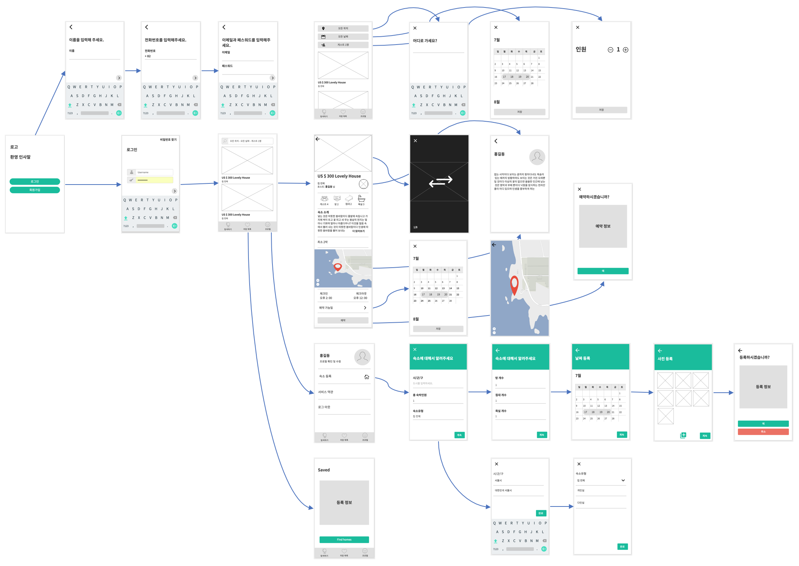

# Team Project

# Crusia

## 목차

- 소개
- 핵심기능
- 멤버 소개
## 소개

- 크루시아는 에어비앤비와 똑같은 어플리케이션을 만드는 것을 목표로 하는 프로젝트입니다.

- Airbnb와 동일한 UI / 기능 제공을 목표로 합니다.

### Prototyping

 
 
## 핵심기능

* 유저관련 기능
	- 이메일 가입 및 로그인
	- 페이스북 가입 및 로그인
	- 토큰으로 로그인 / 로그아웃
	
* 예약관련 기능
	- 숙소등록
	- 숙소리스트
	- 예약하기
	- 예약취소하기
	- 예약확인 이메일
	- 위시리스트
	- 후기 및 평점
	- 호스트에게 문의하기 (mail)

* 호스팅 기능
	- 숙소 등록하기
	- 숙소 상세 정보 제공하기
	- 숙소 이미지 올리기

	
## 참여

- 함형수	| <hhyoungsu@gmail.com> 
- 박찬욱	| <pcugogo@gmail.com> 